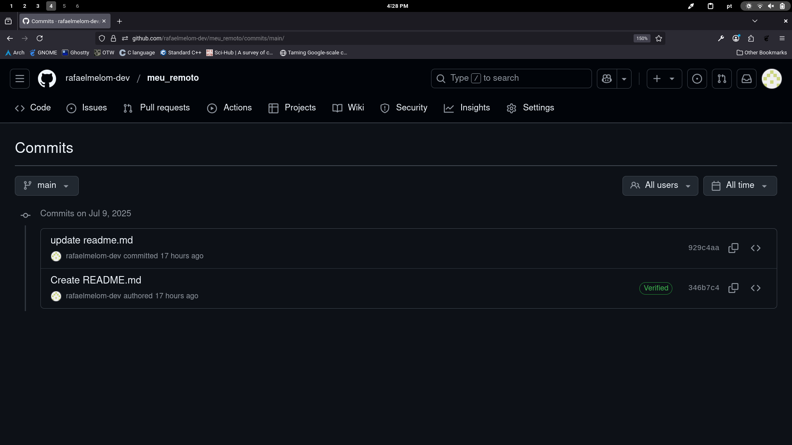

## Atividade

1. Repasse a url de seu repositório a um colega e peça a ele para clonar em outra máquina.
2. Adicione ao repositório local a referência para o repositório de seu colega.
3. Edite o arquivo "readme.md" incluindo ao final "2. Pratique os comandos com as atividades propostas".
4. Faça o "commit" localmente.
5. Observe as diferenças entre os repositórios local, remoto e de seu colega.

--- 
### Testando o compartilhamento do remoto

Para breve teste utilizei um contêiner para simular um outro usuário do `git`. Dado isso então utilizamos o comando `git clone https://github.com/rafaelmelom-dev/meu_remoto`.

Depois de atualizar o arquivo `README.md` e levá-lo para o remoto, e depois de clonarmos temos o seguinte log, utilizando o seguinte comando `git log --all`: 

```
commit 929c4aa26628e6e23380c5ab658a9e1bb0b0a444 (origin/main, origin/HEAD)
Author: Rafael Melo <rafaelmelom.dev@gmail.com>
Date:   Wed Jul 9 23:32:24 2025 -0300

    update readme.md

commit 346b7c472c3f645cfba82e934246ec045712b46a (HEAD -> main)
Author: Rafael Moreira de Melo <132792028+rafaelmelom-dev@users.noreply.github.com>
Date:   Wed Jul 9 23:18:36 2025 -0300

    Create README.md
```

Com isso podemos visualizar que o remoto está à frente do repositório do "colega".

### Realizando mais uma edição ao arquivo `README.md`

Ao adicionar o texto `2. Pratique os comandos com as atividades propostas` e fazer um "commit" local. Podemos ver os logs de cada usuário.

Log atual: 

```
commit 3f55d5e2dad33f62f691f5a13c6cc028a8a23e35 (HEAD -> main)
Author: Rafael Melo <rafaelmelom.dev@gmail.com>
Date:   Thu Jul 10 16:26:47 2025 -0300

    update 2 readme.md

commit 929c4aa26628e6e23380c5ab658a9e1bb0b0a444 (r1/main, r1/HEAD)
Author: Rafael Melo <rafaelmelom.dev@gmail.com>
Date:   Wed Jul 9 23:32:24 2025 -0300

    update readme.md

commit 346b7c472c3f645cfba82e934246ec045712b46a
Author: Rafael Moreira de Melo <132792028+rafaelmelom-dev@users.noreply.github.com>
Date:   Wed Jul 9 23:18:36 2025 -0300

    Create README.md
```

Log do remoto: 



Log do "colega":

```
commit 929c4aa26628e6e23380c5ab658a9e1bb0b0a444 (origin/main, origin/HEAD)
Author: Rafael Melo <rafaelmelom.dev@gmail.com>
Date:   Wed Jul 9 23:32:24 2025 -0300

    update readme.md

commit 346b7c472c3f645cfba82e934246ec045712b46a (HEAD -> main)
Author: Rafael Moreira de Melo <132792028+rafaelmelom-dev@users.noreply.github.com>
Date:   Wed Jul 9 23:18:36 2025 -0300

    Create README.md
```

Observação: vemos o log do colega e do github igual, visto que a edição local não alterou o remoto, e o git do "colega" está sincronizado com o remoto.


