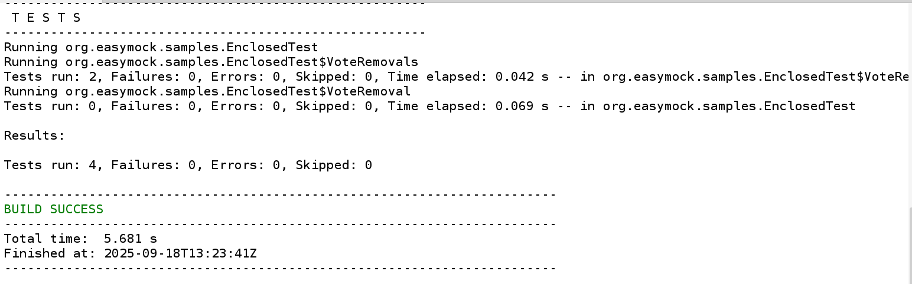
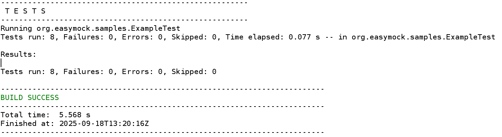
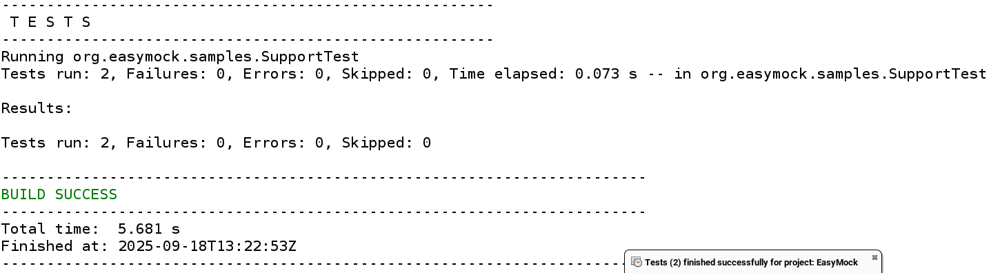

# Atividade 

1. Pesquise sobre os demais tipos de dublês: Dummy Object, Fake Object e Test Spy.
	1. Defina cada um brevemente;
	2. Indique as principais diferenças entre eles;
	3. Dê exemplos práticos.
2. Estude o [tutorial inicial](https://easymock.org/getting-started.html) do EasyMock e teste as [amostras](https://github.com/easymock/easymock/tree/easymock-5.4.0/core/src/samples/java/org/easymock/samples):
	1. Capture e registre a saída de três delas;
	2. Comente os recursos utilizados em cada exemplo.
3. Leia e teste os exemplos nas [referências](https://javadoc.io/doc/org.mockito/mockito-core/latest/org/mockito/Mockito.html) sobre o Mockito:
	1. indique ao menos três exemplos que considere mais notáveis;
	2. Comente as funcionalidades mais interessantes desse framework para a criação de Mocks.
4. Faça um resumo comparativo entre os frameworks para Mock estudados, indicando  como eles facilitam a implementação de cada tipo de Dublê de Teste e dos testes em si.

---
## Alguns outros tipos de dublês

### Dummy Object

São objetos utilizados para simular um comportamento, devido a limitações de dependência em testes unitários, com isso o Dummy Object cria objetos com valores "Dummy", que não são importante para o teste, apenas os dados que serão úteis no teste, como por exemplo um teste que involve o `endereço` na classe `cliente`, não precisamos de outros atributos, como nome, idade, etc. Então colocamos valores no cliente que não importam, apenas o endereço que será importante para o teste.

### Fake Object

São objetos que simulam o comportamento de uma classe, mas com uma lógica bem mais simples, como por exemplo testar uma classe `repositório`, mas ela depende de conexão com o banco de dados, com isso podemos criar um objeto fake, que simula o comportamento dessa classe repositório, como uma lista de valores, por exemplo, a partir daí, essa classe pode fornecer os dados para a classe que iremos testar.

### Test Spy

Como o próprio nome sugere, são objetos que agem como espiões, coletando as informações armazenadas pelo teste, e posteriormente as confirmando. Essa confirmação acontece por meio de frameworks já especializados. Como por exemplo uma classe vídeo, que tem um método play, você pode espiar o método play, e chamá-lo pelo próprio objeto, e após essa chamada, o espião consegue assegurar chamadas e informações posteriormente.

## Easy Mock -- Exemplos

### EnclosedTest

### ExampleTest

### SupportTest

### Finalizando com alguns comentários, ainda não fiz o estudo do Mockito, e nem o comparativo

Esses recursos facilitam no planejamento de testes, já que, muitas vezes teremos classes com dependências, isso é inevitável, e essas manobras são importantes para que se tenha testes unitários, e não deixar o erro de outra classe afetar no teste da classe alvo.